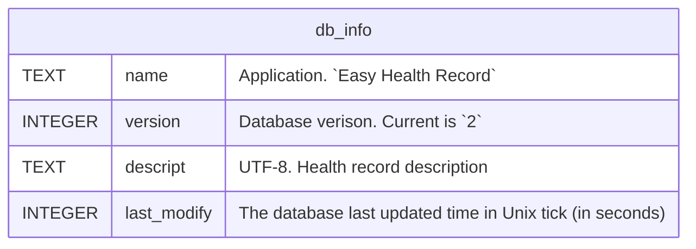
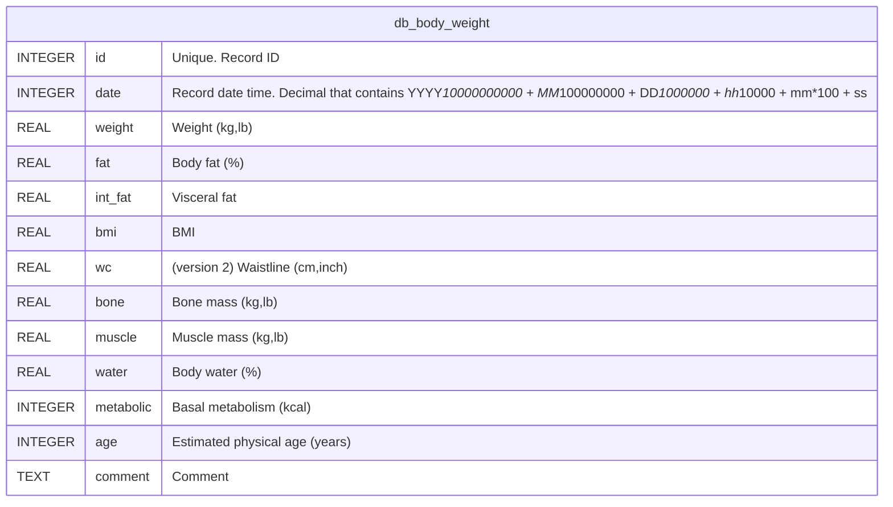
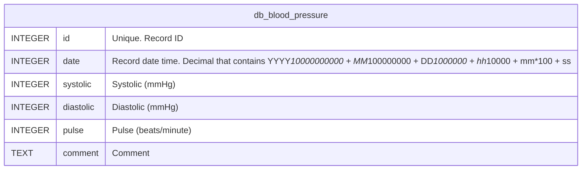
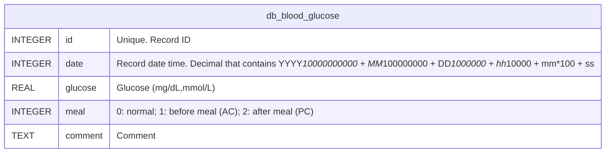

Database Schema
===============

# Database Information

# Body Weight

Descriptions:

- `id`: The unique data identifier. Use Unix tick in seconds because users will not add more than one data in one second.
- `wc`: Added in version 2. Waistline.

# Blood Pressure

Descriptions:

- `id`: The unique data identifier. Use Unix tick in seconds because users will not add more than one data in one second.

# Blood Glucose

Descriptions:

- `id`: The unique data identifier. Use Unix tick in seconds because users will not add more than one data in one second.

